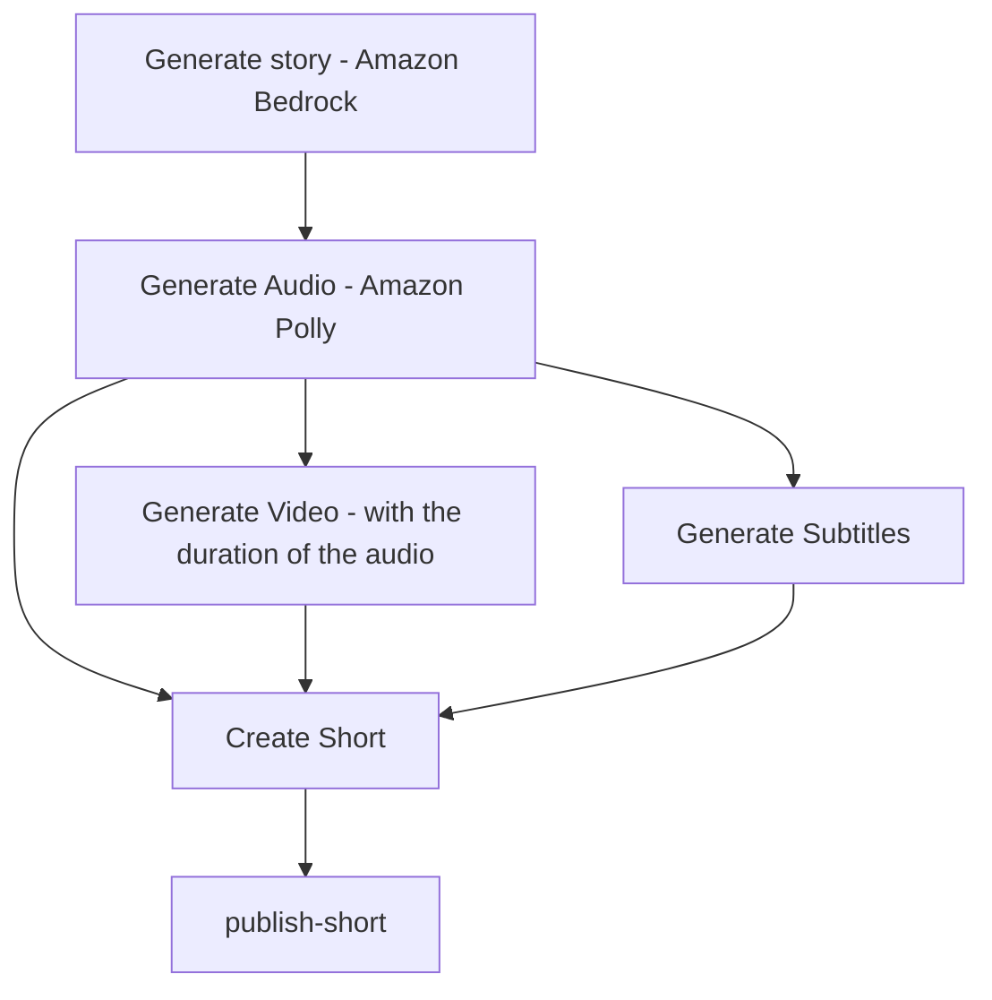
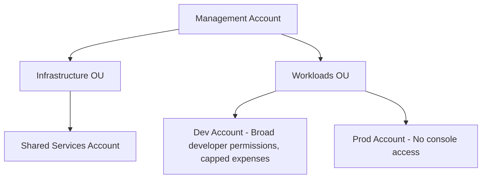

# shorts-media-generator

Generates a shorts-style text reading over video for popular shorts platform using AWS.

## Generation Pipeline

Each step of the shorts-style pipeline is a Lambda function. I chose to use Lambda functions due to the short run-time and the lower price of Lambda over EC2 for short-lived compute.



## Deploying infrastructure

All IaC is defined under `infrastructure/modules`, while configuration specific to a certain environment lives under `infrastructure/environments`.\
On a pull request to main from a feature branch with changes to the `infrastructure` folder, a CI/CD pipeline runs `terraform plan` for both dev and prod. Once the PR is merged the IaC for `dev` is applied, the CI/CD pauses for human review, and only once human review is accepted the `prod` environment is deployed. The dev environment isn't deleted to reduce CI/CD times for future runs, and since the environment doesn't incur much cost when not doing anything due to passing an environment variable that disables EventBridge from triggering the Lambda functions.

## Deploying images

When a new image is created, its appropriate CI/CD pipeline will run.\
It will test the image, build it, push it to ECR (or update the image tag in ECR if it has been previously built in a feature branch), and update the terraform Iac configuration in the `infrastructure` folder to use the newer image tag. This will cause the infrastructure CI/CD pipeline to run again and deploy the new image to the relevant AWS resources.

## Hashing python packages

We hash python packages to ensure that we will not be effected from changes to the packages under the same tag. The process is done like this:

1. Create two files in the current working directory: one with the requirements.txt file that we want to add the hashes of the packages from (requirements.in), and one that we will write the package hashes to (requirements.out). Make sure that requirements.in has the necessary packages that we want to hash (dependencies, distributions, and operating systems will be resolved automatically).

1. Run a python environment in the required version for generating the requirements.txt file with the package hashes:

    ```sh
    docker run --rm \
      -v $(pwd):/app \
      -w /app \
      python:3.13 \
      sh -c "pip install pip-tools && pip-compile --generate-hashes requirements.in -o requirements.out"
    ```

1. Copy the contents of requirements.out to the relevant requirements.txt file in the repository

## Working in a local devcontainer

Each folder under the `docker` folder represents a Docker image. To work on one locally, use the devcontainer with the same name.\
After entering the devcontainer, make sure to run `aws login` to fetch credentials for working with AWS.

## AWS Accounts Structure



- Management Account - The administrative parent of the entire AWS Organization.\
Centralized billing, account creation, and Organization-wide policy enforcement via SCPs.\
No application workloads, databases, or public endpoints.
  - Infrastructure OU - Houses dedicated accounts for shared resources.
    - Shared Services Account - Hosts resources that are shared between different workload accounts (E.g. ECR for docker images for both dev and prod).
  - Workloads OU - Houses dedicated accounts for workloads.
    - Dev Account - Account for developers. allows manual changes and rapid pipeline iterations.
    - Prod Account - Live workloads.\
      Locked down to automated deployment via pipelines.\
      No console or manual access.

## Signing in to AWS via CLI

Since we are using multiple AWS accounts, we must configure the AWS cli to use SSO to authenticate to the accounts.

1. In `~/.aws/config`:

    ```toml
    [sso-session shorts-generator]
    sso_start_url = <aws-organization-portal-url>
    sso_region = <aws-region>

    [profile management]
    sso_session = shorts-generator
    sso_account_id = <management-account-id>
    sso_role_name = <management-account-role>
    region = <aws-region>

    [profile shared-services]
    sso_session = shorts-generator
    sso_account_id = <shared-services-account-id>
    sso_role_name = <shared-services-account-role>
    region = <aws-region>

    [profile dev]
    sso_session = shorts-generator
    sso_account_id = <dev-account-id>
    sso_role_name = <dev-account-role>
    region = <aws-region>

    [profile prod]
    sso_session = shorts-generator
    sso_account_id = <prod-account-id>
    sso_role_name = <prod-account-role>
    region = <aws-region>
    ```

1. Before working, run the following command to login to AWS SSO:

    ```sh
    aws sso login --sso-session shorts-generator
    ```

1. When running a command, specify the profile to be used:

    ```sh
    aws ec2 describe-vpcs --profile dev
    ```

## Bootstrapping Resources

We require a couple of AWS resources in order to run Terraform via CI/CD:

- an S3 bucket to store and lock state.
- An AWS role with permissions for the the Github runner to assume.
- An OIDC connection for the Github runner to get temporary credentials for the role.

We first create the required AWS resources from an admin account by running Terraform locally, then migrate the local terraform state into the S3 bucket.\
Each account has its own S3 bucket.

All configuration for the bootstrapping sits in ./infrastructure/bootstrap.

1. Change to the required directory:

    ```sh
    cd ./infrastructure/bootstrap
    ```

1. Login to all of the required accounts:

    ```sh
    aws sso login --sso-session shorts-generator
    ```

1. For each environment (dev, shared-services, or prod):

    1. Ensure that no the local state files exist (`./infrastructure/bootstrap/terraform.tfstate` and `./infrastructure/bootstrap/terraform.tfstate.backup`). If they do, delete them:

        ```sh
        rm terraform.tfstate terraform.tfstate.backup
        ```

    1. If the directory `.terraform` exists, delete it in order to clear the cache from the previous run:

        ```sh
        rm -rf .terraform
        ```

    1. Initialize the directory:

        ```sh
        terraform init -reconfigure
        ```

    1. In `providers.tf` ensure that the backend configuration is empty.

    1. Create the bootstrap resource (for the shared-services environment use shared-svcs as the value of the `environment` variable):

        ```sh
        AWS_PROFILE=<environment> terraform apply \
            -var="environment=<environment>" \
            -var="org_name=shorts-generator" \
            -var="aws_region=us-east-1" \
            -var="github_org=yahav2305" \
            -var="github_repo=shorts-generator"
        ```

        and make sure to note the output.

    1. Put the value of the CI/CD ARN role as a repository secret in github for the current environment under the name `AWS_<environment>_CICD_ROLE_ARN`.

    1. In `providers.tf` add an empty S3 bucket backend:

        ```hcl
        backend "s3" {}
        ```

    1. Then migrate the state to the S3 bucket:

        ```sh
        AWS_PROFILE=<environment> terraform init -migrate-state \
            -backend-config="bucket=<environment-bucket-name>" \
            -backend-config="key=bootstrap/terraform.tfstate" \
            -backend-config="region=us-east-1" \
            -backend-config="use_lockfile=true" \
            -backend-config="encrypt=true"
        ```

    1. After the migration, add the following S3 backend configuration to the environment in `./infrastructure/environments/<environment>/providers.tf`:

        ```hcl
        terraform {
            backend "s3" {
                bucket         = "<environment-bucket-name>"
                key            = "<environment>/terraform.tfstate"
                use_lockfile   = true
                region         = var.region
                encrypt        = true
            }
        }
        ```

For any future change of the bootstrap resources after the initial run (when the state is already in an S3 bucket):

1. Change to the required directory:

    ```sh
    cd ./infrastructure/bootstrap
    ```

1. Delete the `.terraform` folder if switching environments or if previously ran `terraform init` with a different provider backend.

    ```sh
    rm -rf .terraform
    ```

1. Ensure that in `providers.tf` the backend is defined as:

    ```hcl
    backend "s3" {}
    ```

1. Initialize the directory (env is dev, prod, or shared-services)

    ```sh
    AWS_PROFILE=<env> terraform init \
        -backend-config="bucket=<env-bucket-name>" \
        -backend-config="key=bootstrap/terraform.tfstate" \
        -backend-config="region=us-east-1" \
        -backend-config="use_lockfile=true" \
        -backend-config="encrypt=true"
    ```

1. Apply the changed resources (env is dev, prod, or shared-services. for the environment shared-services put shared-svcs as the value of the `environment` variable):

    ```sh
    AWS_PROFILE=<env> terraform apply \
        -var="environment=<env>" \
        -var="org_name=shorts-generator" \
        -var="aws_region=us-east-1" \
        -var="github_org=yahav2305" \
        -var="github_repo=shorts-generator"
    ```
